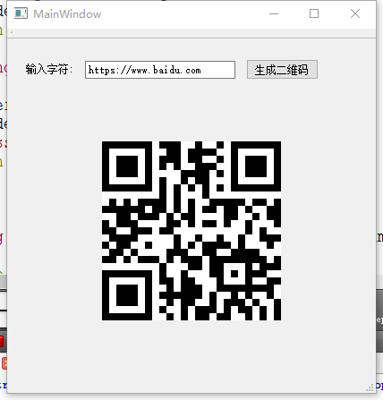
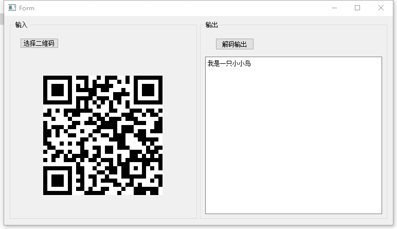

# Qt-EncodeAndDecode
Qt版本的二维码生成与解析工具库

## 编译

### enCode生成二维码

encode使用了开源的二维码qrencode库。但是这个库依赖png库，png又依赖zlib。本库使用了QPainter来绘制图形，不需要libpng和zlib，直接编译即可用。

### deCode解析二维码

deCode使用了QZXing库来对二维码进行解析

